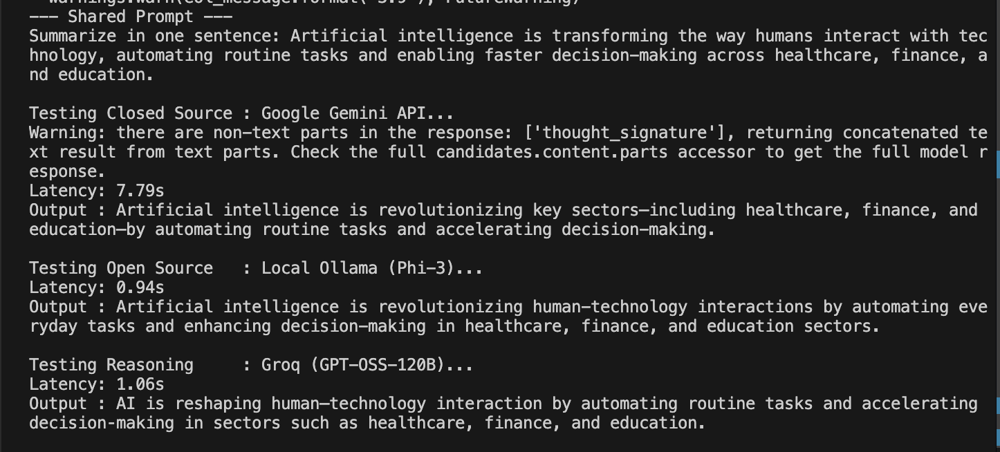

# Model Comparison & Latency Benchmark

A minimal, modular project comparing execution latency and output across three categories of AI models using a single shared prompt.

---

## 📸 Benchmark Output

> Attach your terminal output screenshot here:
> 
> 

---

## 🧪 Models Benchmarked

| Category | Model Name | Host / Provider | Thinking Configuration | Observed Latency |
| :--- | :--- | :--- | :--- | :--- |
| **Closed Source** | `gemini-3.6-flash` | Google Cloud API | `thinking_budget = 1024` (Minimal) | **~7.79s** |
| **Open Source** | `phi3` | Ollama (Local) | N/A | **~0.94s** |
| **Reasoning** | `openai/gpt-oss-120b` | Groq Cloud | `reasoning_effort = "high"` (High) | **~1.06s** |

---

## 🧠 Exploring Thinking in Models

In this experiment, we explored controlling model **reasoning depth** across providers:

1. **Google Gemini (`gemini-3.6-flash`)**:
   - Configured with `thinking_config=types.ThinkingConfig(thinking_budget=1024)`.
   - Constrains internal thinking tokens to lower response latency while processing reasoning signatures (`thought_signature`).

2. **Groq Cloud (`openai/gpt-oss-120b`)**:
   - Configured with `reasoning_effort="high"`.
   - Forces deep step-by-step reasoning tokens before emitting the final summary.

---

## ⚡ Understanding Performance & Hardware Bias

Despite configuring **High Thinking** on Groq and **Minimal Thinking** on Gemini, Groq (~1.06s) was vastly faster than Gemini (~7.79s).

### Key Reasons:
* **Custom LPU Hardware vs GPUs**: Groq uses custom **LPUs (Language Processing Units)** engineered for deterministic token generation (**300–500+ tokens/sec**). Generating long thinking chains takes barely ~1 second.
* **Local Edge Execution**: Local Ollama (`phi3`) runs entirely on local RAM/silicon with zero network round-trip time (~0.94s).
* **API Overhead & Safety Filters**: Gemini API includes Google Cloud authentication gateways, safety filter processing, and standard cloud GPU batching overhead.

---

## 📁 Project Structure

```
model_comparison/
├── prompt.txt           # Shared prompt passed to all 3 models
├── config.py            # Loads .env keys & model parameters
├── .env.example         # Template for environment secrets
├── output/              # Place benchmark output screenshots here
│   └── terminal_output.png
├── models/
│   ├── gemini_model.py  # Closed source API call
│   ├── ollama_model.py  # Local REST API call
│   └── groq_model.py    # Groq LPU API call
└── main.py              # Main benchmark runner script
```

---

## 🚀 Quickstart

1. **Install Dependencies**:
   ```bash
   pip install -r requirements.txt
   ```

2. **Set API Keys**:
   ```bash
   cp .env.example .env
   ```
   Add your `GEMINI_API_KEY` and `GROQ_API_KEY` in `.env`.

3. **Run Benchmark**:
   ```bash
   python main.py
   ```
